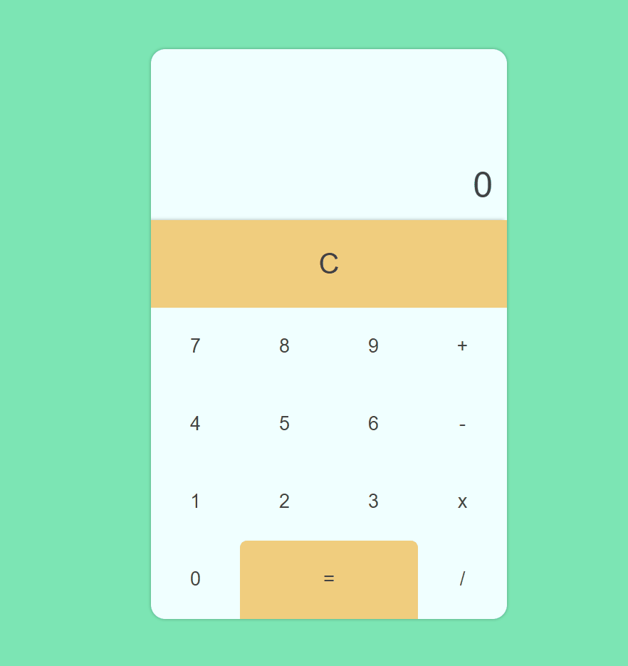

# calculator-app




> O projeto trata-se de uma calculadora. Nele, você será capaz de realizar operações matemáticas simples. Esse projeto foi desenvolvido com as tecnologias <strong>HTML5</strong>, <strong>CSS3</strong> e <strong>Javascript</strong>.

### Ajustes e melhorias

Tarefas já adicionadas ao projeto:

- [X] Design
- [X] Resposividade
- [X] Funcionalidades


## 🚀 Como executar o projeto


### Pré-requisitos

Antes de começar, verifique se você atendeu aos seguintes requisitos:

* Navegador `<Google Chrome / Firefox / Microsoft Edge / Safari>`


## 🚀 Baixando o código

Para baixar o calculator-app, siga estas etapas:

Linux, macOS e Windows:
```
git clone https://github.com/devCleidison/calculator-app.git
```

ou baixe o arquivo compactado diretamente pelo link:
```
https://github.com/devCleidison/calculator-app/archive/refs/heads/main.zip
```

## ☕ Usando o calculator-app

Para usar o calculator-app, siga estas etapas:

```
Abra a pasta do projeto e execute o arquivo index.html dando 2 cliques
```

## 🚀 Quer testar antes?
* [Clique aqui!](https://devcleidison-calculator-app.netlify.app/)


[⬆ Voltar ao topo](#calculator-app)<br>